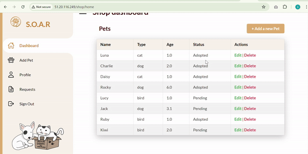

# Java Project
# S.O.A.R (Support Our Adoption Rescue)

## Project Overview

S.O.A.R (Support Our Adoption Rescue) is a user-friendly website dedicated to facilitating pet adoption and providing shelter to pets in need. The primary goal is to offer an accessible platform where users can explore, learn about, and ultimately adopt pets. By leveraging technology, the website seeks to enhance the adoption experience, ensuring that pets find loving homes while encouraging responsible pet ownership.

<div align="center">
  
</div>

## Objectives

- **Pet Adoption Facilitation:** Enable users to browse profiles of pets available for adoption, including detailed descriptions and images to facilitate informed decisions.
- **User-Friendly Interface:** Design an intuitive interface that enhances the user experience, making it easy for visitors to navigate and interact with the website.

## Requirements

### Functional Requirements

1. **Different Interfaces for Admin, Shop Owner, and Adopter**
    - Separate interfaces for admin, shop owner, and adopter with distinct functionalities.
    - Admins have the ability to create, update, and delete shops.
    - Shop owners have the ability to create, update, and delete their pets. They can also see the adopters' requests.
    - Adopters can browse a comprehensive list of all available pets and view detailed information about each pet. They can submit a request to adopt a pet and manage their favorites list by adding and removing pets.

2. **User Registration and Authentication**
    - Users can register and create accounts.
    - Secure authentication mechanisms (e.g., email verification, password encryption).

3. **Pet Listing Management**
    - Authorized users (shelters, shops) can add/edit/delete pet profiles.
    - Pet profiles include name, breed, age, and photos.

4. **User Interaction Features**
    - Registered users can like pets to create a favorites list.

5. **Responsive Design**
    - Mobile-friendly and responsive design.

6. **Security and Privacy**
    - Data protection and compliance with regulations.
    - User privacy settings management.

7. **Validations**
    - Include validation for each user, pet, or shop added.

## Design


## User Interfaces

Our website offers a welcoming experience with easy access to important links, including a cart and AJAX-managed pet filtering. The navbar features buttons for favourites, logout, and profile, ensuring seamless navigation. The home page, cart page, and About Us page are styled with custom CSS and JavaScript for enhanced interactivity. Users can explore detailed pet profiles, request adoptions, and learn about our partners. The site includes a FAQ section, a contact form, and various user interfaces such as the Besties Page for adoption requests, Edit Profile Page, and Favourites Page. User validations ensure secure account management, and Spring Security provides robust protection with role-based access control, password encoding, custom authentication handling, and exception management for unauthorized access attempts.

<div align="center">
  
</div>


## Shop Interface
<div align="center">
  
</div>


### Shop Home Page
The shop dashboard for managing pets includes a navigation menu and a table of pets with options to edit or delete. 

### Add Pet Page
Form for adding new pets with validation for pet details. Styled with CSS and includes JavaScript for interactivity. 

### Edit Pet Page
Allows Shop owners to update pet details with validation and error messages. .

### Request Page
Displays a list of pet adoption requests with options to accept or refuse. Includes a button to add a new pet. .

### Pet Validations

Ensures pet data integrity with validations for name, type, breed, city, image URL, description, and age.

## Admin Interface

<div align="center">
  
</div>

### Admin Dashboard Page
Overview of key metrics including partners, adopted pets, unadopted pets, and donations. Features data visualizations with Chart.js. 

### Tables Page
Displays tables for shops and users with options to edit or delete entries. Includes Chart.js for visual data representations. 

### Admin Add Shop Page
Form for adding new shops, including validation for shop and user details. 

### Edit Shop Page
Allows administrators to update existing shop details with validation. 

### Shop Validations

Ensures shop data consistency with validations for name, city, maximum capacity, current pet count, and phone number.

---


## Architecture

### System Architecture

1. **Frontend**
    - Developed using modern frameworks (Spring Boot).
    - Responsive design with HTML, CSS, and JavaScript.

2. **Backend**
    - RESTful API for handling data requests.
    - Built with a robust framework (Spring Boot).

3. **Database**
    - Relational database (MySQL) for structured data.

4. **Hosting and Deployment**
    - Cloud-based hosting (AWS) for scalability and reliability.

## Installation

### Prerequisites

- Java 11 or higher
- Maven
- MySQL

### Steps

1. Clone the repository:
    ```bash
    git clone https://github.com/your-username/soar.git
    cd soar
    ```

2. Set up the database:
    - Create a new MySQL database.
    - Update the `application.properties` file with your database configuration.

3. Build and run the project:
    ```bash
    mvn clean install
    mvn spring-boot:run
    ```

## Usage

- Navigate to `http://localhost:8080` to access the website.
- Register a new account or log in with existing credentials.
- Browse pets, add them to your favorites, and submit adoption requests.

## Contributing

Contributions are welcome! Please fork the repository and create a pull request with your changes.


